# Preview

UI screenshots for **CardSense Web** and **Mobile**. Images live under [`docs/images/`](./images/) in `web/` and `mobile/`.

---

## 1. Web app

Base URL: [http://localhost:3000](http://localhost:3000) (local dev). Screenshots use a logged-in test account unless noted.

### 1.1 Landing

**Route:** `/`

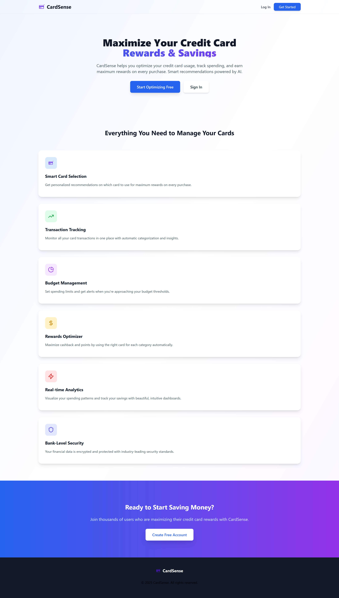

*Public home page before sign-in.*

---

### 1.2 Login

**Route:** `/login`

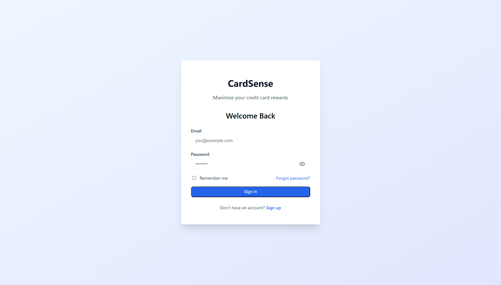

---

### 1.3 Dashboard

**Route:** `/dashboard`  
**Nav:** Dashboard · Transactions · Budgets · Cards · Analytics

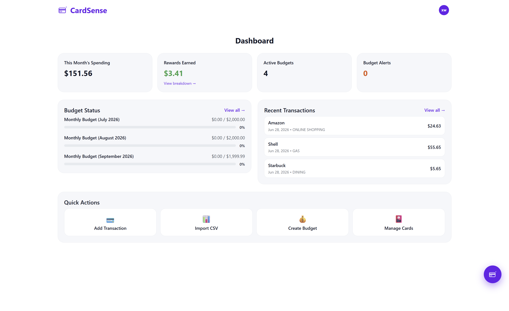

*Month-to-date spending, rewards, budget status (up to 3), alerts, recent transactions (up to 3), and quick actions. Floating **Assistant** button (bottom-right).*

---

### 1.4 Transactions

**Route:** `/transactions`

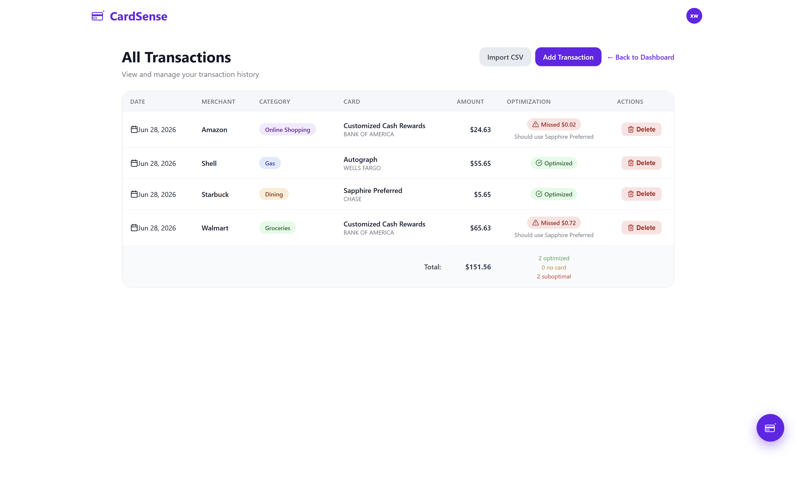

*List view with category pills, optimization hints, and edit/delete actions.*

---

### 1.5 Cards

**Route:** `/cards`

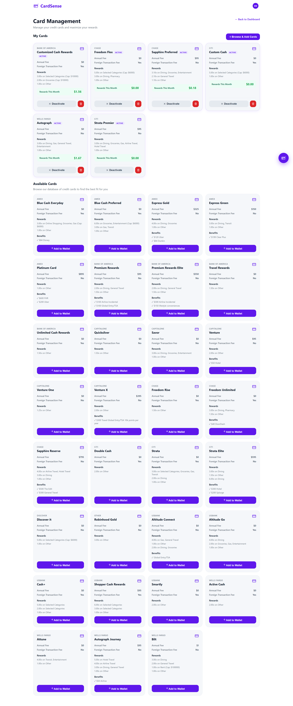

*Wallet and catalog — add cards, view reward rules.*

---

### 1.6 Rewards breakdown

**Route:** `/rewards` (from dashboard rewards card)

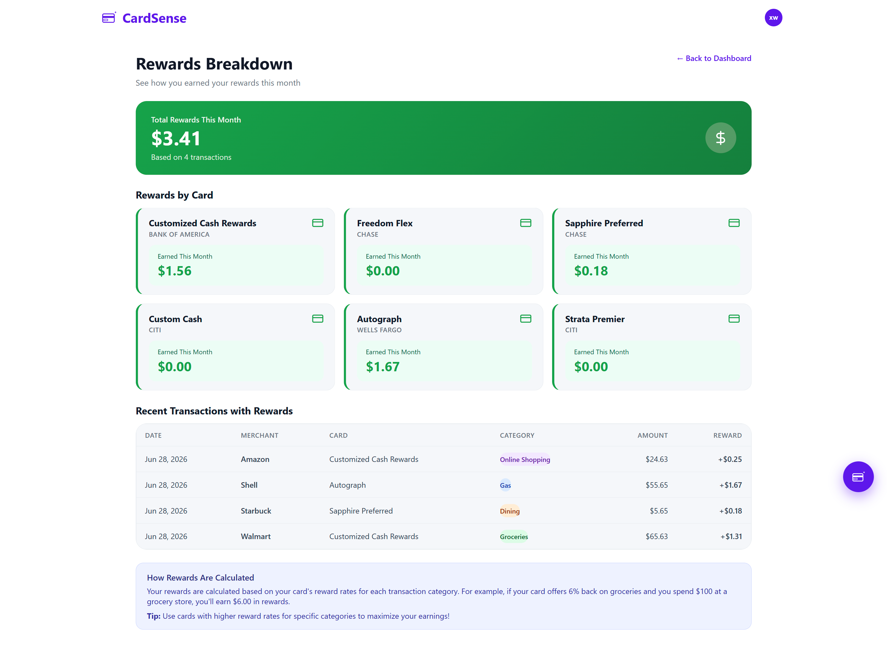

*Per-card and category reward summary for the current month.*

---

### 1.7 Assistant

**UI:** Floating chat widget on any authenticated page (not a top-nav route).

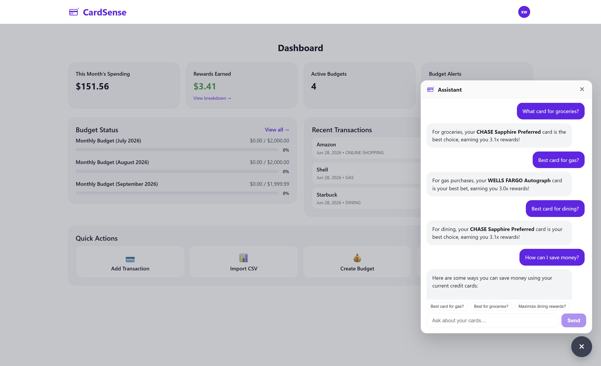

*Gemini-powered Q&A — card picks, rewards tips, wallet-aware answers. History syncs with Mobile.*

---

### 1.8 Settings

**Route:** `/settings`

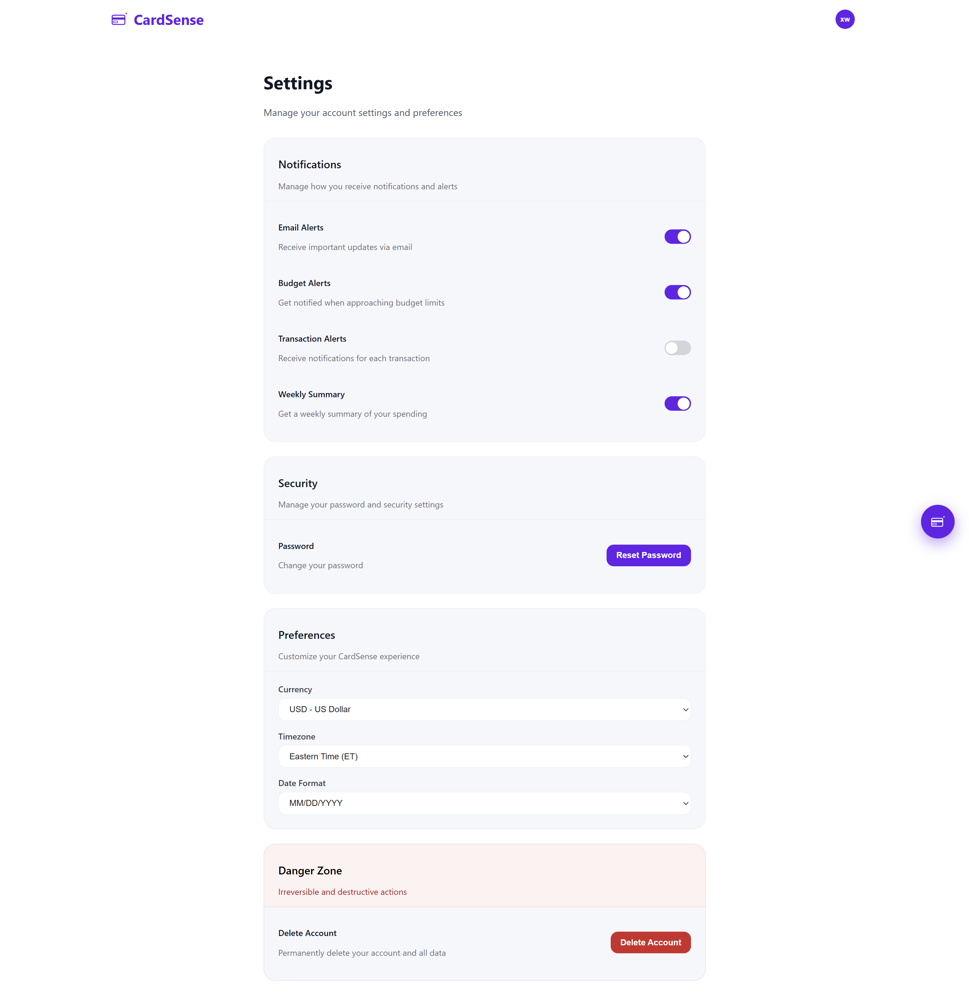

*Profile, preferences, and account options.*

---

## 2. Mobile app

Run via Expo Go or a simulator with the backend up — see [installation.md](./installation.md).

**Bottom nav (main tabs):** Dashboard · Transaction · **Assistant** · Cards · Account

<table>
<tr>
<td width="50%" valign="top">
<h4>2.1 Welcome</h4>

<strong>Screen:</strong> Auth welcome / entry

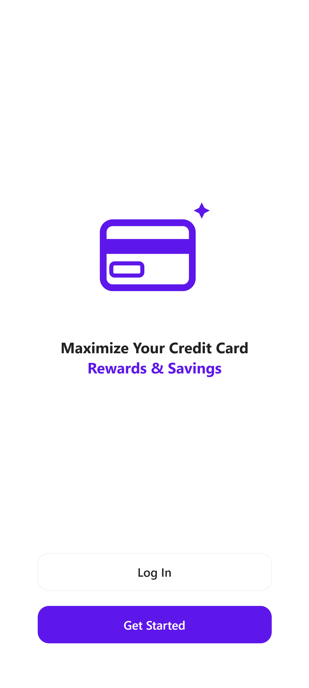
</td>
<td width="50%" valign="top">
<h4>2.2 Login</h4>

<strong>Screen:</strong> Log in

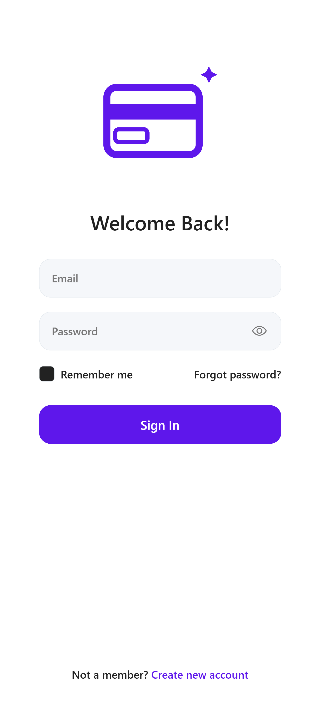
</td>
</tr>
<tr>
<td width="50%" valign="top">
<h4>2.3 Dashboard</h4>

<strong>Tab:</strong> Dashboard

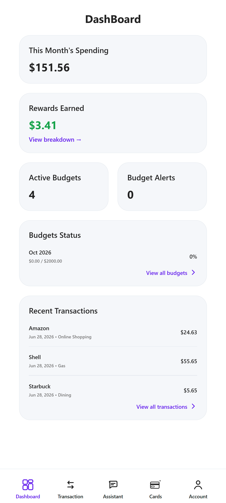

<em>Spending, rewards, budgets, recent transactions.</em>

</td>
<td width="50%" valign="top">
<h4>2.4 Transactions</h4>

<strong>Tab:</strong> Transactions

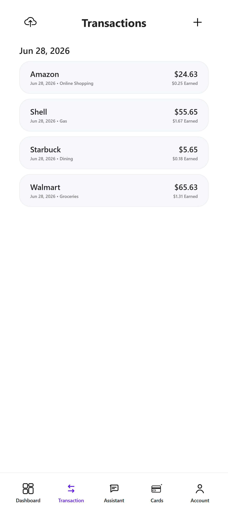
</td>
</tr>
<tr>
<td width="50%" valign="top">
<h4>2.5 Assistant</h4>

<strong>Tab:</strong> Assistant (center of bottom nav)

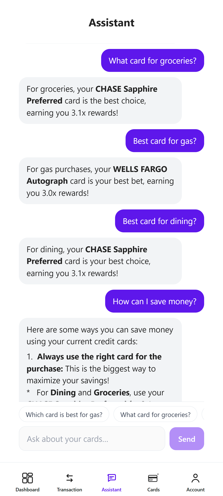

<em>Shares chat history with Web on the same account.</em>

</td>
<td width="50%" valign="top">
<h4>2.6 Cards</h4>

<strong>Tab:</strong> Cards

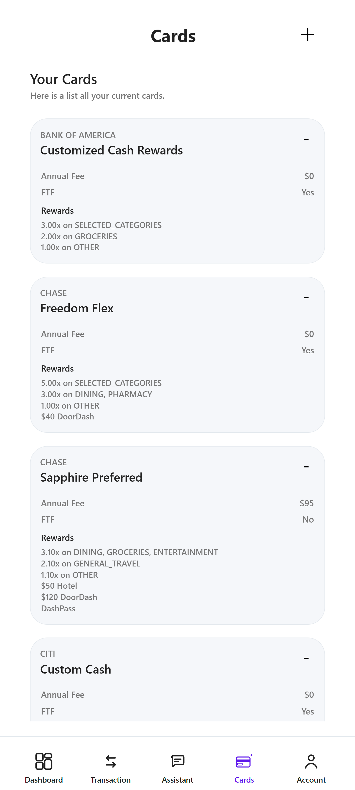
</td>
</tr>
<tr>
<td width="50%" valign="top">
<h4>2.7 Account / Settings</h4>

<strong>Tab:</strong> Account (bottom nav)

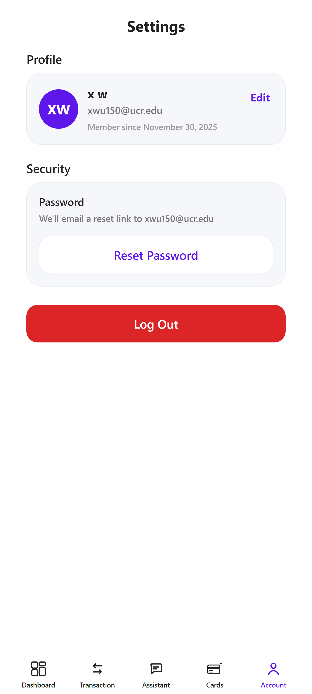
</td>
<td width="50%" valign="top">
<h4>2.8 Rewards breakdown</h4>

<strong>Route:</strong> <code>/(tabs)/rewards</code> — dashboard → View breakdown →

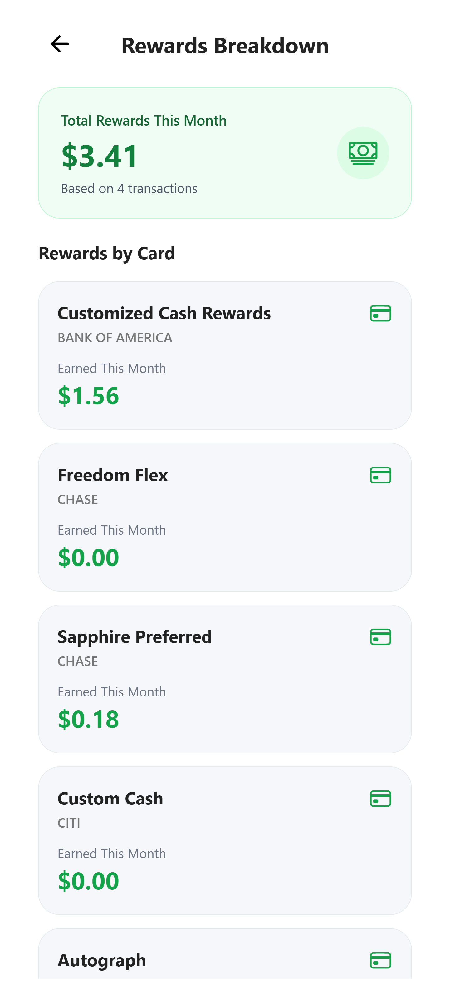
</td>
</tr>
</table>

## Related docs

- [usage.md](./usage.md) — Feature walkthrough (text)
- [installation.md](./installation.md) — Run Web & Mobile locally
- [documentation.md](./documentation.md) — Architecture and API reference
